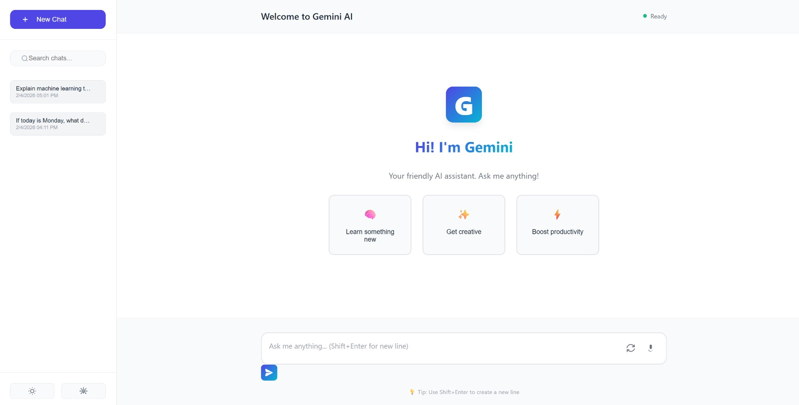
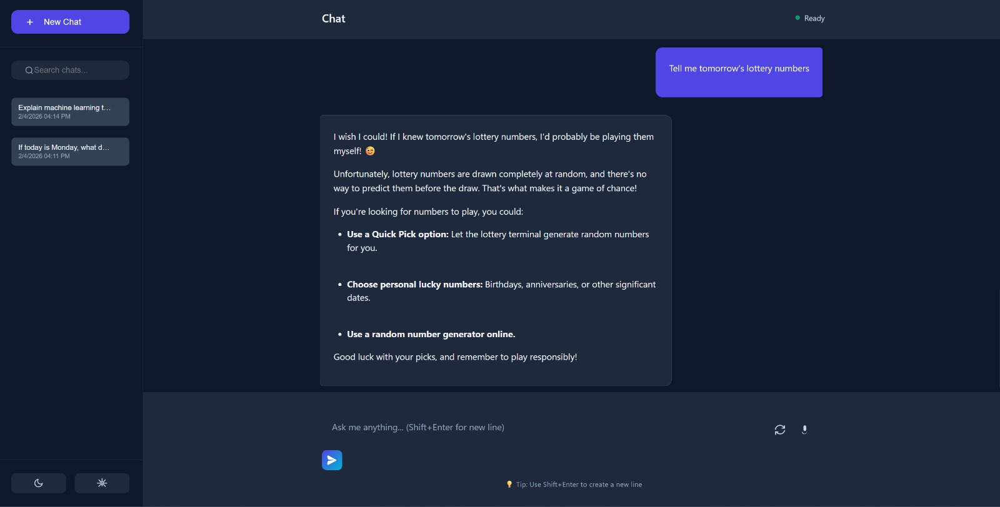
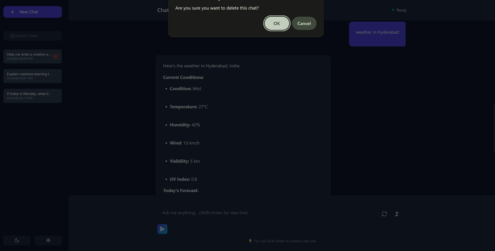

# 🤖 Gemini AI Chatbot

A **production-ready, full-stack AI chatbot application** built with Google Gemini API. This portfolio-grade project demonstrates expert-level skills in full-stack development, featuring advanced UI/UX, real-time streaming, voice I/O, and comprehensive conversation management.

## ✨ Key Features

### 🎯 Core Features
- **Unlimited Conversation Memory** - Store, search, and manage all chat history permanently
- **Dark/Light Theme** - Smooth theme switching with CSS variables and localStorage
- **Streaming Responses** - Character-by-character response streaming like ChatGPT
- **Real-time Search Integration** - Auto-detect queries needing live data (prices, weather, news)
- **Voice Input/Output** - Speech-to-text and text-to-speech capabilities
- **File Processing** - Upload and process PDF, TXT, DOCX, and image files
- **Multiple AI Models** - Switch between Gemini Pro, Flash, and Vision models
- **Export Options** - Export conversations as PDF, JSON, or Markdown

### 🚀 Advanced Features
- **Responsive Design** - Works perfectly on desktop, tablet, and mobile
- **Keyboard Shortcuts** - Cmd/Ctrl+K, Ctrl+N, and more
- **Message Actions** - Copy, edit, delete, and regenerate responses
- **Token Counter** - Real-time API usage and cost estimation
- **Connection Status** - Real-time connectivity indicator
- **Search Conversations** - Find specific conversations and messages
- **Favorite Conversations** - Star important chats for quick access
- **Professional UI Components** - Smooth animations and transitions

## 📊 Architecture

```
gemini-chatbot/
├── app/
│   ├── __init__.py                 # Flask app factory
│   ├── routes/
│   │   ├── chat.py                 # Chat API endpoints
│   │   ├── conversations.py        # Conversation CRUD
│   │   └── files.py                # File upload & processing
│   ├── models/
│   │   └── database.py             # SQLAlchemy models
│   ├── services/
│   │   ├── gemini_service.py       # Gemini API wrapper
│   │   ├── search_service.py       # SerpAPI integration
│   │   ├── voice_service.py        # Voice features
│   │   └── file_service.py         # File handling
│   └── utils/
│       ├── streaming.py            # SSE streaming
│       └── export.py               # Export functionality
├── static/
│   ├── css/
│   │   ├── main.css                # Core styles + variables
│   │   ├── animations.css          # All animations
│   │   └── components/
│   │       ├── chat.css            # Chat UI
│   │       ├── sidebar.css         # Sidebar
│   │       └── settings.css        # Settings panel
│   └── js/
│       ├── modules/
│       │   ├── chat.js             # Chat logic
│       │   ├── theme.js            # Theme switching
│       │   ├── voice.js            # Voice features
│       │   └── files.js            # File handling
│       ├── utils/
│       │   ├── api.js              # API client
│       │   └── streaming.js        # Streaming utilities
│       └── app.js                  # Main app
├── templates/
│   └── index.html                  # Single-page HTML
├── config.py                       # Configuration
├── app.py                          # Entry point
├── requirements.txt                # Python dependencies
├── .env.example                    # Environment template
├── Dockerfile                      # Docker config
└── docker-compose.yml              # Docker compose
```

## 🛠️ Tech Stack

### Backend
- **Flask** - Lightweight Python web framework
- **SQLAlchemy** - ORM for database management
- **SQLite** - Embedded database (production: PostgreSQL)
- **Google Generative AI SDK** - Gemini API integration
- **SerpAPI** - Real-time web search
- **PyPDF2, python-docx, Pillow** - File processing

### Frontend
- **Vanilla JavaScript** (ES6+) - No frameworks, pure JS
- **CSS3** - CSS Variables, Flexbox, Grid, Animations
- **HTML5** - Semantic markup
- **Web Speech API** - Voice input/output
- **Server-Sent Events** - Real-time streaming

## 📸 Application Screenshots

<div align="center">

### Welcome Screen

*Clean welcome interface with quick prompts*

### Chat Conversation  

*Example conversation with AI response streaming*

### Chat Management

*Chat history sidebar with delete functionality*

</div>

## 🚀 Getting Started

### Prerequisites
- Python 3.11+
- Google Gemini API Key ([Get one free](https://aistudio.google.com/app/apikey))
- Optional: SerpAPI key for search features
- Node.js/npm (for static asset optimization)

### Installation

1. **Clone and setup**
```bash
cd gemini-chatbot
python -m venv venv
source venv/bin/activate  # On Windows: venv\Scripts\activate
pip install -r requirements.txt
```

2. **Configure environment**
```bash
cp .env.example .env
# Edit .env and add your API keys
```

3. **Run development server**
```bash
python app.py
# Open http://localhost:5000
```

### Docker Deployment

```bash
# Using docker-compose (recommended)
docker-compose up --build

# Or manual Docker
docker build -t gemini-chatbot .
docker run -p 5000:5000 -e GEMINI_API_KEY=your_key gemini-chatbot
```

## 📖 API Documentation

### Chat Endpoints

#### POST `/api/v1/chat`
Send a message and get streamed response (Server-Sent Events)

**Request:**
```json
{
    "message": "What is quantum computing?",
    "conversation_id": 1,
    "model": "gemini-pro"
}
```

**Response:** Server-Sent Events stream with `{type: 'chunk', data: 'character'}`

#### POST `/api/v1/chat/save-response`
Save AI response after streaming completes

```json
{
    "conversation_id": 1,
    "response": "Quantum computing is...",
    "tokens_used": 150
}
```

### Conversation Endpoints

#### GET `/api/v1/conversations`
List all conversations

**Query parameters:**
- `sort_by`: 'updated_at', 'created_at', 'title'
- `order`: 'asc', 'desc'
- `favorite`: true/false

#### GET `/api/v1/conversations/:id`
Get conversation with all messages

#### POST `/api/v1/conversations`
Create new conversation

#### PUT `/api/v1/conversations/:id`
Update conversation (title, favorite, etc.)

#### DELETE `/api/v1/conversations/:id`
Delete conversation

#### POST `/api/v1/conversations/:id/export`
Export conversation

**Query parameters:**
- `format`: 'json', 'markdown', 'pdf'

### File Endpoints

#### POST `/api/v1/upload`
Upload file (multipart)

#### GET `/api/v1/files`
List files for conversation/message

#### POST `/api/v1/files/process`
Extract text from uploaded file

#### DELETE `/api/v1/files/:id`
Delete file

## 🎨 UI/UX Highlights

### Color Scheme
**Dark Mode** (Default)
- Background: `#0f172a`
- Cards: `#1e293b`
- Accent: `#3b82f6`
- Text: `#f8fafc`

**Light Mode**
- Background: `#f8fafc`
- Cards: `#ffffff`
- Accent: `#2563eb`
- Text: `#1e293b`

### Responsive Breakpoints
- **Desktop**: 1024px+ (full sidebar)
- **Tablet**: 768px-1024px (collapsible sidebar)
- **Mobile**: <768px (minimal interface, voice-first)

### Accessibility
- ARIA labels on all interactive elements
- Keyboard navigation support (Tab, Enter, Escape)
- High contrast mode compatible
- Focus indicators on interactive elements
- Reduced motion preferences respected

## 🔧 Configuration

### Environment Variables
```env
# Flask
FLASK_ENV=development
SECRET_KEY=your-secret-key

# API Keys
GEMINI_API_KEY=sk-xxxxx
SERPAPI_API_KEY=xxxxx

# Database
DATABASE_URL=sqlite:///chatbot.db

# Server
PORT=5000
HOST=0.0.0.0

# File Upload
UPLOAD_FOLDER=uploads
MAX_CONTENT_LENGTH=52428800

# CORS
CORS_ORIGINS=*
```

## 📊 Database Schema

### Users
- `id` - Primary key
- `username` - Unique username
- `email` - User email
- `theme_preference` - 'dark' or 'light'
- `preferred_model` - Default AI model
- `created_at` - Account creation date

### Conversations
- `id` - Primary key
- `user_id` - Foreign key to users
- `title` - Conversation title
- `model_used` - AI model used
- `is_favorite` - Starred conversation
- `total_tokens` - API token usage
- `created_at` - Conversation start time
- `updated_at` - Last message time

### Messages
- `id` - Primary key
- `conversation_id` - Foreign key to conversations
- `role` - 'user' or 'assistant'
- `content` - Message text
- `tokens_used` - Tokens for this message
- `has_search` - Used live search
- `created_at` - Message timestamp

### Attachments
- `id` - Primary key
- `message_id` - Foreign key to messages
- `filename` - Stored filename
- `original_filename` - Original filename
- `file_type` - 'pdf', 'txt', 'image', etc.
- `file_size` - Bytes
- `file_path` - Relative path
- `content_preview` - First 500 chars

## 🚨 Error Handling

The application includes comprehensive error handling:

- **API Errors**: User-friendly error messages
- **File Upload Errors**: Type and size validation
- **Connection Errors**: Auto-retry with exponential backoff
- **Token Limits**: Warning when approaching rate limits
- **Streaming Errors**: Graceful fallback to non-streaming

## 🔒 Security Features

- **Input Sanitization**: XSS protection with HTML escaping
- **API Key Handling**: Keys stored in environment variables
- **CORS Protection**: Configurable cross-origin settings
- **File Validation**: Type and size checks
- **SQL Injection Prevention**: SQLAlchemy parameterized queries
- **Session Management**: Secure session cookies

## 📈 Performance Optimization

- **Lazy Loading**: Conversation history loads on-demand
- **Debounced Search**: Reduces API calls during typing
- **CSS Variables**: Fast theme switching without reflow
- **Image Optimization**: SVG icons throughout
- **Response Caching**: Search results cached
- **Lazy Rendering**: Messages rendered incrementally
- **Web Workers**: File processing in background
- **Compression**: Gzip enabled in production

## 🧪 Testing

```bash
# Run tests
python -m pytest

# With coverage
pytest --cov=app
```

## 🌐 Deployment

### Production Checklist
- [ ] Set `FLASK_ENV=production`
- [ ] Use strong `SECRET_KEY`
- [ ] Configure PostgreSQL instead of SQLite
- [ ] Set up HTTPS/SSL
- [ ] Configure CORS origins properly
- [ ] Set rate limiting
- [ ] Enable database backups
- [ ] Monitor API usage
- [ ] Set up error logging

### Vercel/Netlify (Frontend Only)
The frontend can be deployed separately if needed:

```bash
npm run build
# Deploy 'dist' folder
```

### Railway/Heroku
```bash
# Deploy with Procfile
web: gunicorn --bind 0.0.0.0:$PORT app:app
```

## 📚 Learning Resources

- [Google Generative AI Python SDK](https://github.com/google/generative-ai-python)
- [Flask Documentation](https://flask.palletsprojects.com/)
- [SQLAlchemy ORM](https://docs.sqlalchemy.org/)
- [Web Speech API](https://developer.mozilla.org/en-US/docs/Web/API/Web_Speech_API)
- [Server-Sent Events](https://developer.mozilla.org/en-US/docs/Web/API/Server-sent_events)

## 🎯 Future Enhancements

- [ ] User authentication and profiles
- [ ] Team collaboration features
- [ ] Custom AI model training
- [ ] Plugin system for integrations
- [ ] Advanced analytics dashboard
- [ ] Conversation scheduling
- [ ] Multi-language support
- [ ] Offline mode with sync
- [ ] Mobile app (React Native)
- [ ] Customizable UI themes

## 📝 License

This project is open source and available under the MIT License.

## 🤝 Contributing

Contributions are welcome! Feel free to open issues or submit pull requests.

